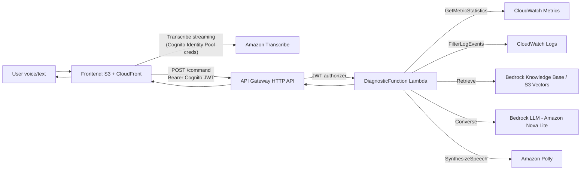

# VoiceOps CloudFormation Stacks

This folder contains the AWS infrastructure for **VoiceOps AI**: an AI SRE assistant that answers spoken or typed operational questions by correlating live CloudWatch telemetry with Bedrock Knowledge Base runbooks, reasoning over them with a Bedrock LLM, and replying with synthesized speech.

## Stacks

| # | Template | Purpose |
| --- | --- | --- |
| 1 | [observabilitys3infra.yaml](./observabilitys3infra.yaml) | Telemetry S3 bucket, CloudWatch log group, and a "replay" Lambda that loads mock CSV telemetry into CloudWatch metrics/logs for the demo. |
| 2 | [knowledge-base.yaml](./knowledge-base.yaml) | Bedrock Knowledge Base backed by S3 source documents and an S3 Vectors index (runbooks, service docs, past incidents). |
| 3 | [frontend-fixed.yaml](./frontend-fixed.yaml) | Private S3 + CloudFront static frontend, Cognito User Pool (hosted login) and Identity Pool (temporary credentials for browser-side Amazon Transcribe streaming). |
| 4 | [direct-backend.yaml](./direct-backend.yaml) | The diagnostic Lambda, its IAM role, and an HTTP API Gateway (`GET /services`, `POST /command`) protected by a Cognito JWT authorizer. |

Deploy in this order, since later stacks consume earlier stacks' outputs as parameters:

```
observabilitys3infra.yaml → knowledge-base.yaml → frontend-fixed.yaml → direct-backend.yaml
```

## Architecture / request flow



The `DiagnosticFunction` Lambda (defined inline in [direct-backend.yaml](./direct-backend.yaml)) is the core of the backend:

1. **Resolve scope** — determines which service (`checkout-api`, `order-worker`, `payment-api`) the question is focused on, or treats it as global.
2. **Query CloudWatch** — `cloudwatch:GetMetricStatistics` for the relevant metrics, and `logs:FilterLogEvents` against the application log group for recent errors/exceptions.
3. **Retrieve from the Knowledge Base** — `bedrock:Retrieve` against the Bedrock Knowledge Base (runbooks, service docs, incident history) using a query built from the question plus observed error types.
4. **Reason with the LLM** — `bedrock:InvokeModel`/`Converse` against the configured foundation model (default `amazon.nova-lite-v1:0`), passing live metrics, logs, and KB guidance as separate, clearly-labeled evidence sources so the model doesn't confuse symptoms with remediation.
5. **Convert text to speech** — `polly:SynthesizeSpeech` (neural engine, `Joanna` voice) turns the generated analysis into an MP3, returned to the frontend as `audio_mp3_base64` for playback.
6. **Respond** — returns `{ analysis, focused_service, audio_mp3_base64, evidence }` as JSON to API Gateway, which proxies it back to the browser.

## Stack details

### 1. `observabilitys3infra.yaml` — Observability infrastructure

| Parameter | Default | Description |
| --- | --- | --- |
| `Environment` | `demo` | Deployment environment suffix. |
| `MetricNamespace` | `VoiceOps/Demo` | CloudWatch namespace the replay Lambda publishes to and the backend reads from. |
| `DatabaseCsvKey` | `checkout_api_mock.csv` | S3 key for checkout-api telemetry mock data. |
| `LambdaThrottlingCsvKey` | `lambda_throttling_mock.csv` | S3 key for order-worker throttling mock data. |
| `PaymentCsvKey` | `payment_api_mock.csv` | S3 key for payment-api telemetry mock data. |

Key resources: `TelemetryBucket` (upload target for the CSVs), `ApplicationLogGroup` (`/voiceops/<Environment>/application`), and `ReplayFunction`, a Lambda that reads the three CSVs and publishes matching `PutMetricData` metrics and `PutLogEvents` log entries so the demo has live-looking telemetry.

Key outputs: `TelemetryBucketName`, `ReplayFunctionName`, `MetricNamespace`, `ApplicationLogGroupName`.

**Post-deploy step:** upload the three CSV files to `TelemetryBucketName`, then invoke `ReplayFunctionName` to populate CloudWatch.

### 2. `knowledge-base.yaml` — Bedrock Knowledge Base

| Parameter | Default | Description |
| --- | --- | --- |
| `Environment` | `demo` | Deployment environment suffix. |
| `EmbeddingModelId` | `amazon.titan-embed-text-v2:0` | Embedding model used to vectorize documents. |

Key resources: `KnowledgeSourceBucket` (Markdown runbooks/docs), `VectorBucket`/`VectorIndex` (S3 Vectors, 1024-dim cosine index), and `KnowledgeBase`/`KnowledgeDataSource` (Bedrock Knowledge Base with fixed-size chunking, 500 max tokens, 20% overlap).

Key outputs: `KnowledgeSourceBucketName`, `KnowledgeBaseId` (consumed by `direct-backend.yaml`), `KnowledgeBaseArn`, `DataSourceId`.

**Post-deploy step:** upload the documents from [knowledgebase_docs/](../knowledgebase_docs) to `KnowledgeSourceBucketName`, then start an ingestion job on `DataSourceId` so they're embedded into the vector index.

### 3. `frontend-fixed.yaml` — Frontend hosting and auth

| Parameter | Default | Description |
| --- | --- | --- |
| `Environment` | `demo` | Deployment environment suffix. |
| `CustomDomainName` | `voiceopsaihackathon.dev` | Canonical public hostname; a CloudFront Function rejects any other `Host` header. |
| `CloudFrontCertificateArn` | *(required)* | ACM certificate ARN for the custom domain; must be issued in `us-east-1`. |

Key resources: `FrontendBucket` (private, OAC-only access) + `Distribution` (CloudFront), `UserPool`/`UserPoolClient`/`UserPoolDomain` (Cognito hosted UI login, MFA required, admin-created users only), `IdentityPool`/`AuthenticatedRole` (grants only `transcribe:StartStreamTranscription*` — nothing else — to authenticated browser sessions).

Key outputs: `FrontendBucketName`, `IdentityPoolId`, `UserPoolId`, `UserPoolClientId`, `CognitoLoginDomain`, `WebsiteUrl`.

**Post-deploy step:** populate [voiceops_frontend/config.js](../voiceops_frontend/config.js) with these outputs (plus the backend `ApiEndpoint`), build the frontend, and upload it to `FrontendBucketName`.

### 4. `direct-backend.yaml` — Diagnostic Lambda and API

| Parameter | Default | Description |
| --- | --- | --- |
| `Environment` | `demo` | Deployment environment suffix. |
| `KnowledgeBaseId` | *(required)* | Output from `knowledge-base.yaml`. |
| `MetricNamespace` | `VoiceOps/Demo` | Must match `observabilitys3infra.yaml`. |
| `ApplicationLogGroupName` | `/voiceops/demo/application` | Must match `observabilitys3infra.yaml`. |
| `FoundationModelId` | `amazon.nova-lite-v1:0` | Bedrock LLM used for diagnosis reasoning. |
| `AllowedOrigin` | `https://voiceopsaihackathon.dev` | CORS origin allowed to call the API. |
| `CognitoUserPoolId` / `CognitoUserPoolClientId` | *(from frontend stack)* | Used to validate the JWT on `POST /command`. |
| `LookbackMinutes` | `90` (5–1440) | How far back CloudWatch metrics/logs are queried. |

Key resources: `DiagnosticRole` (least-privilege: CloudWatch metrics/logs read, `bedrock:Retrieve` scoped to the one Knowledge Base, `bedrock:InvokeModel` scoped to the one foundation model, `polly:SynthesizeSpeech`), `DiagnosticFunction` (Python 3.12, 60s timeout, 512MB), `HttpApi` with two routes:

- `GET /services` — **no auth**; returns current status/metrics for all configured services (used to populate the dashboard).
- `POST /command` — **Cognito JWT authorizer**; accepts `{ query | transcript | prompt, focused_service? }` and returns the diagnosis + evidence + MP3 audio.

Key outputs: `ApiEndpoint` (`POST /command` URL), `ServicesEndpoint` (`GET /services` URL), `DiagnosticFunctionName`, `JwtAuthorizerId`.

## Deployment checklist

1. Deploy `observabilitys3infra.yaml`; upload the mock CSVs and invoke the replay Lambda to seed CloudWatch.
2. Deploy `knowledge-base.yaml`; upload runbook/service/incident Markdown docs and run an ingestion job.
3. Request/validate an ACM certificate for the custom domain in `us-east-1`, then deploy `frontend-fixed.yaml`.
4. Deploy `direct-backend.yaml`, passing `KnowledgeBaseId` (from step 2) and the Cognito User Pool ID/client ID (from step 3).
5. Update [voiceops_frontend/config.js](../voiceops_frontend/config.js) with the Identity Pool, User Pool, Cognito domain, and `apiBaseUrl` outputs, then build and upload the frontend to the S3 bucket from step 3 and invalidate CloudFront.

## Security notes

- `DiagnosticRole` scopes `bedrock:Retrieve`/`bedrock:InvokeModel` to the specific Knowledge Base/model ARNs rather than `*`.
- `POST /command` is protected by a Cognito JWT authorizer; `GET /services` is intentionally public (read-only dashboard data, no PII).
- The Cognito `AuthenticatedRole` used by the browser grants **only** `transcribe:StartStreamTranscription*` — the frontend never receives credentials capable of calling the backend's AWS resources directly.
- All S3 buckets block public access and enforce default encryption; the frontend bucket is only reachable through CloudFront via Origin Access Control.
