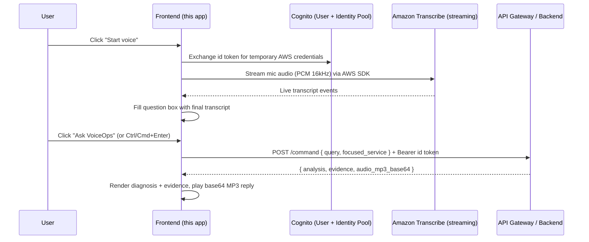

# VoiceOps Frontend

A single-page, framework-free web console for **VoiceOps AI** — an AI SRE assistant that lets an on-call engineer monitor live CloudWatch service health and ask incident questions by voice or text. The browser streams microphone audio straight to **Amazon Transcribe** for speech-to-text, sends the resulting question to the backend **API Gateway**, and plays back the AI's spoken answer.

## How it works



1. **Sign-in** — On load, the app redirects unauthenticated users to the Cognito Hosted UI (Authorization Code + PKCE flow) and stores the resulting `id_token`/`access_token` in `sessionStorage`.
2. **Service health** — `GET {apiBaseUrl}/services` is polled on load and every `refreshIntervalSeconds` to populate the service grid and the Chart.js metric chart. There is no hard-coded health data in the frontend; everything comes from CloudWatch via the backend.
3. **Voice capture** — Clicking the mic button requests microphone access, exchanges the Cognito id token for temporary AWS credentials (via the Identity Pool), and opens an Amazon Transcribe streaming session directly from the browser. Final (non-partial) transcript results are written into the question textarea.
4. **Ask the assistant** — Clicking **Ask VoiceOps** (or `Ctrl`/`Cmd`+`Enter`) sends the question, plus the currently focused service (if any), to `POST {apiBaseUrl}/command` with an `Authorization: Bearer <access token>` header.
5. **Response rendering** — The backend's JSON response (`analysis`, `evidence.log_events_considered`, `evidence.kb_results_considered`, `evidence.metrics`, etc.) is rendered in the diagnosis and evidence panels. If the response includes `audio_mp3_base64`, it is decoded and played back automatically; **Stop audio** interrupts playback.

## Features

- Live CloudWatch-backed service health grid with status badges (Healthy / Degraded / Critical / Stale / No data)
- Per-service metric chart (Chart.js) with a metric selector
- Voice question input via real-time Amazon Transcribe streaming (no server-side audio upload)
- Text question input with quick-prompt chips ("What is failing?", "What changed?", etc.)
- Spoken AI answers (MP3 played back from a base64 payload returned by the backend)
- Cognito Hosted UI login/logout (Authorization Code + PKCE, tokens kept in `sessionStorage` only)
- Auto-refreshing backend/service status indicator

## Project structure

| File | Purpose |
| --- | --- |
| [index.html](./index.html) | Page markup/layout for the service grid, chart, assistant, diagnosis, and evidence panels. |
| [app.js](./app.js) | Application source: Cognito auth, service polling, Transcribe streaming, API calls, chart and UI rendering. Bundled with esbuild into `bundle.js`. |
| [bundle.js](./bundle.js) | Build output (generated by `npm run build`). Do not edit directly. |
| [config.js](./config.js) | Runtime configuration (`window.VOICEOPS_CONFIG`) loaded before `bundle.js`; the only file you typically need to edit per environment. |
| [styles.css](./styles.css) | Styling for the dashboard layout and components. |
| [package.json](./package.json) | Build script and AWS SDK / Chart.js dependencies. |

## Prerequisites

- Node.js (for `npm` and the `esbuild` bundler)
- A deployed VoiceOps backend stack exposing `GET /services` and `POST /command` via API Gateway
- A Cognito User Pool (hosted UI) and a Cognito Identity Pool trusting that User Pool (for temporary AWS credentials used by Transcribe streaming)
- A browser with microphone access over HTTPS (or `localhost`) for the voice feature

## Configuration (`config.js`)

Edit `config.js` before building/deploying. All values are read from `window.VOICEOPS_CONFIG`:

| Key | Description |
| --- | --- |
| `region` | AWS region for Cognito and Transcribe (e.g. `us-east-1`). |
| `userPoolId` | Cognito User Pool ID. |
| `userPoolClientId` | Cognito User Pool app client ID (public client, no secret). |
| `cognitoDomain` | Cognito Hosted UI domain, e.g. `https://<domain>.auth.<region>.amazoncognito.com`. |
| `redirectUri` | URL Cognito redirects to after login; must be registered as an allowed callback URL on the app client. |
| `logoutUri` | URL Cognito redirects to after logout; must be registered as an allowed sign-out URL. |
| `identityPoolId` | Cognito Identity Pool ID used to mint temporary AWS credentials for Transcribe streaming. |
| `userPoolProviderName` | Identity Pool login provider key, e.g. `cognito-idp.<region>.amazonaws.com/<userPoolId>`. |
| `apiBaseUrl` | Base URL of the backend API Gateway (no trailing path), e.g. `https://<id>.execute-api.<region>.amazonaws.com`. |
| `refreshIntervalSeconds` | Polling interval for `GET /services`; set to `0` to disable auto-refresh. |

## Build

```bash
npm ci
npm run build
```

This bundles `app.js` (and its AWS SDK / Chart.js dependencies) into `bundle.js` using esbuild (`iife`, browser target).

## Deploy

Upload `index.html`, `styles.css`, `config.js`, and `bundle.js` to the frontend S3 bucket and invalidate CloudFront so clients pick up the new build.

For the full infrastructure sequence (CloudFormation stacks for the backend, knowledge base, and frontend), see the repository-level `README.md`.

## Backend API expectations

- `GET /services` — returns `{ source, namespace, generated_at, services: [{ name, status, status_reason, metrics }] }`.
- `POST /command` — accepts `{ query, focused_service? }` with an `Authorization: Bearer <access_token>` header, and returns `{ analysis, focused_service?, evidence: { log_events_considered, kb_results_considered, metrics }, audio_mp3_base64? }`.

## Security notes

- Tokens are kept only in `sessionStorage` (cleared on tab close/logout) and never sent to the backend except as a bearer token over HTTPS.
- AWS credentials for Transcribe streaming are short-lived, scoped via Cognito Identity Pool, and requested fresh for each voice session — no long-lived AWS keys are embedded in the frontend.
- `config.js` only contains public client identifiers (User Pool client ID, Identity Pool ID, API URL); it holds no secrets.
